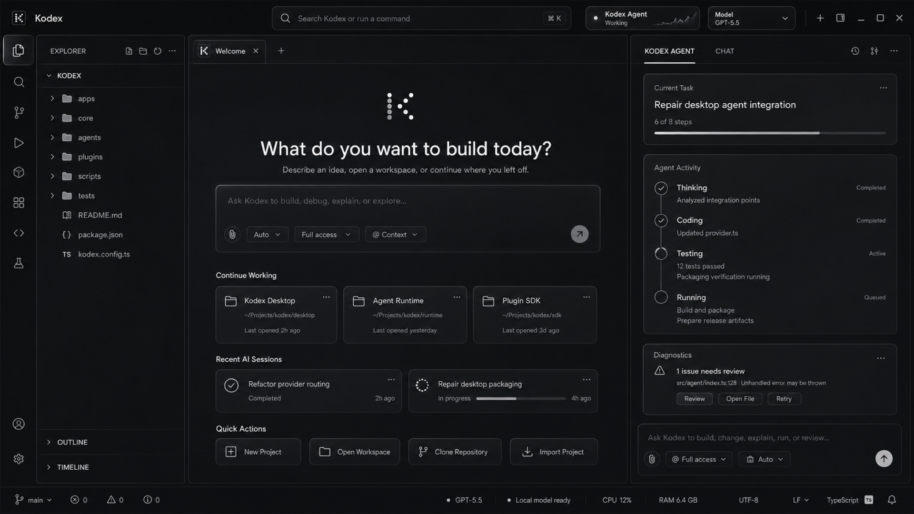

<div align="center">
  

  # Kodex

  **An open-source, local-first AI IDE and visual application studio for building real software with Codex, Claude, Ollama, LM Studio, and OpenAI-compatible models.**

  [](LICENSE)
  [](#platform-support)
  [](#development-and-testing)
  [](apps/desktop)
  [](apps/core)

  [Features](#features) · [Visual App Studio](#visual-app-studio) · [Install](#quick-start) · [Architecture](#architecture) · [Contributing](CONTRIBUTING.md)
</div>



## What is Kodex?

Kodex is a desktop AI development environment designed to help people plan, create, debug,
run, and maintain software without giving up control of their source code or local machine.
It combines a VS Code-style workspace, a persistent autonomous coding agent, an integrated
terminal, project intelligence, model-provider choice, and a source-authoritative visual UI
designer in one application.

Unlike a chat window that only suggests code, Kodex can inspect a workspace, create a plan,
edit files through typed tools, run commands, validate results, recover interrupted work, and
show its activity inside the same project window. Every consequential operation is governed by
an explicit permission mode, and real framework files remain the source of truth.

Kodex is open source under the MIT License.

## Why Kodex Helps

- **Build complete applications:** move from an idea to scaffolded, validated source code.
- **Use the model you prefer:** connect ChatGPT Codex, Claude Code, Ollama, LM Studio, or an
  OpenAI-compatible endpoint.
- **Keep work local:** the Core service, project state, terminal, files, and local-model traffic
  stay on your machine by default.
- **Understand every change:** inspect agent steps, changed files, source ranges, diagnostics,
  validation output, and recovery actions.
- **Design and code together:** visually edit supported interfaces while preserving normal
  React, Flutter, XAML, Compose, SwiftUI, or HTML source files.
- **Recover safely:** snapshots, conflict detection, stale-file protection, process cancellation,
  transaction history, and persistent sessions reduce the cost of interrupted work.
- **Extend the IDE:** plugins can add AI tabs, project templates, designer adapters, toolbox
  components, and specialized workflows.

## Features

### AI Coding Agent

- Natural-language chat, planning, and implementation modes.
- Multi-step autonomous execution with visible task and tool activity.
- ChatGPT Codex and Claude Code account integrations.
- Local model support through Ollama and LM Studio.
- OpenAI-compatible cloud and self-hosted provider support.
- Steering messages while an agent run is active.
- Approval gates for sensitive, destructive, credential, and external operations.
- Context condensation, provider fallback, recovery attempts, and completion validation.

### Desktop IDE

- File explorer, Monaco code editor, symbol outline, search, source control, timeline, tasks,
  plugins, diagnostics, and model settings.
- Integrated PTY terminal with multiple terminal sessions.
- Run and debug profile detection for common project types.
- Native menus for File, Edit, Selection, View, Go, Run, Terminal, Window, and Help.
- Resizable explorer, editor, terminal, and AI panel.
- Workspace restoration, autosave awareness, external-change detection, and snapshots.

### Visual App Studio

Kodex includes an AI-native visual application designer inspired by Visual Studio and modern
low-code tools. Supported UI files can be opened from the Designer activity panel or by
double-clicking them in the explorer.

- Design, Source, Split, and Preview editor modes.
- Component toolbox, hierarchy tree, responsive canvas, device profiles, and properties panel.
- Drag/drop and source-generating component insertion.
- Exact source-line navigation from visual elements.
- Conflict-checked edits with transaction-based undo and redo.
- AI context for the selected node, hierarchy, properties, source ranges, diagnostics, and
  active device preview.
- Project templates for websites, desktop applications, Windows applications, macOS/iOS apps,
  Android apps, Flutter apps, APIs, and custom projects.

Adapter coverage:

| Framework | Support |
| --- | --- |
| React / TSX and HTML | Full designer |
| Electron + React | Full designer and desktop project template |
| Flutter | Full-tier source mapping and mobile profiles |
| .NET MAUI / XAML | Core visual adapter |
| Android Jetpack Compose | Core visual adapter |
| SwiftUI | Core visual adapter |

See [Visual App Studio documentation](docs/VISUAL_APP_STUDIO.md).

### Plugin System

- Kodex remains permanently available as the first agent tab.
- Enabled AI providers appear as independent tabs with their own branding and model selection.
- Plugins can be enabled, disabled, opened, or deleted.
- Deleting an active provider returns the UI to Kodex safely.
- Plugin manifests support agent tabs, uninstall behavior, project templates, toolbox
  contributions, and designer adapters.

## Quick Start

### Requirements

- Node.js 20 or newer
- npm 10 or newer
- Python 3.10 or newer
- Git
- Optional: Codex CLI, Claude Code CLI, Ollama, or LM Studio

### Install and Run

```bash
git clone https://github.com/fireyhellmarketing-cmd/kodex.git
cd kodex
npm install
npm run start
```

`npm run start` launches the native Kodex desktop shell, Vite renderer, and authenticated local
Core service. Core listens on `127.0.0.1:7799` by default.

### Connect an AI Provider

- **ChatGPT Codex:** open Settings → Models and use the official Codex browser login.
- **Claude Code:** install/login through the official Claude Code CLI.
- **Ollama:** start Ollama locally; Kodex discovers installed models.
- **LM Studio:** start the local server, normally at `http://127.0.0.1:1234/v1`.
- **OpenAI-compatible:** configure a base URL, model, and securely stored API key.

Kodex does not ask you to paste ChatGPT or Claude account passwords into the app.

## Architecture

```text
apps/
├── core/       Python, FastAPI, SQLite, agent runtime, tools, recovery, designer API
└── desktop/    Electron, React, TypeScript, Monaco, xterm.js, native IPC
plugins/        AI provider and Kodex workspace plugins
scripts/        Core bundling and release validation
packaging/      Platform packaging and signing configuration
docs/           Visual designer and developer documentation
```

### Core

The Python Core owns workspace-safe file operations, conversations, agent runs, approvals,
provider routing, task persistence, snapshots, process control, diagnostics, project
intelligence, memory, Git operations, and visual designer transactions.

### Desktop

Electron owns native dialogs, secure credential storage, application lifecycle, menus, terminal
PTYs, project scaffolding, plugin lifecycle operations, update checks, and the authenticated
connection to Core. React renders the IDE and Monaco provides source editing.

### Security Model

- Core binds to localhost and uses a per-install bearer token.
- Workspace paths are resolved and checked before filesystem access.
- Provider credentials use Electron `safeStorage`.
- Destructive and sensitive operations require explicit approval.
- Agent edits are applied through typed workspace tools with snapshots and validation.
- Full-access mode does not silently bypass sensitive-operation approval.

Read [SECURITY.md](SECURITY.md) before reporting a vulnerability.

## Platform Support

Kodex packages for:

- macOS, including Apple Silicon
- Windows
- Linux

The GitHub Actions packaging workflow builds on each native operating system. Framework-specific
mobile or desktop targets still require their official SDKs, such as Flutter, Android Studio,
Xcode, or .NET.

## Development and Testing

```bash
# Python Core tests
PYTHONPATH=apps/core/src python3 -m unittest discover -s apps/core/tests -v

# Desktop checks
npm run lint -w apps/desktop
npm run test:terminal -w apps/desktop
npm run build -w apps/desktop

# Complete distribution validation
npm run release:validate
```

Current local verification covers 75 Core tests, desktop lint/build, terminal behavior,
cross-platform package targets, native runtime assets, authenticated API health, and Electron
smoke launching.

## Build Native Packages

```bash
npm run package:mac -w apps/desktop
npm run package:win -w apps/desktop
npm run package:linux -w apps/desktop
```

Signing and notarization are optional for local development and required for trusted public
distribution. See [packaging/README.md](packaging/README.md).

## Roadmap

- Richer AST-backed framework transformations.
- Live framework preview sessions and emulator controls.
- Complete responsive constraints, alignment, grouping, and multi-selection.
- More designer adapters and community project templates.
- Signed releases and automatic updates.
- Expanded accessibility diagnostics and visual regression fixtures.

## Contributing

Contributions, bug reports, documentation improvements, framework adapters, project templates,
and provider integrations are welcome. Read [CONTRIBUTING.md](CONTRIBUTING.md) before opening a
pull request.

Please keep changes focused, preserve existing user files, add tests proportional to risk, and
verify both Core and desktop behavior.

## Open Source License

Kodex is released under the [MIT License](LICENSE). You may use, copy, modify, merge, publish,
distribute, sublicense, and sell copies subject to the license terms.

## Keywords

AI IDE, open-source AI coding assistant, autonomous coding agent, local AI development
environment, Codex desktop app, Claude Code IDE, Ollama coding assistant, LM Studio IDE,
Electron IDE, Python FastAPI agent, visual app builder, React visual designer, Flutter app
builder, XAML designer, Jetpack Compose designer, SwiftUI designer, local-first developer tools.

---

<div align="center">
  Built as an open platform for people who want AI assistance without surrendering their tools,
  source code, or ability to understand what changed.
</div>
