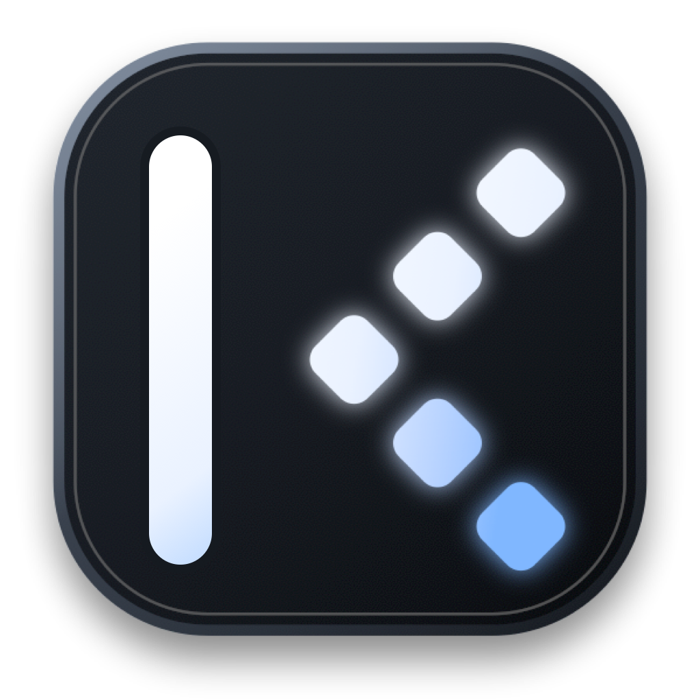

# Kodex

<p align="center">
  
</p>

<p align="center">
  <strong>An open-source, local-first AI coding IDE with a source-linked autonomous agent.</strong>
</p>

<p align="center">
  <a href="LICENSE"></a>
  
  
  
</p>

Kodex is a desktop development environment for programmers who want an AI coding agent working
inside a familiar IDE. It combines Monaco editing, an integrated terminal, Run and Debug,
Git workflows, project intelligence, local model support, approvals, recovery, and persistent
agent sessions in one application.

Kodex works directly with real source files. Agent edits, commands, approvals, failures, changed
files, and validation results remain visible and reviewable.

## Why Kodex

- **Code in a real IDE:** Monaco Editor, file explorer, search, outline, terminal, source control,
  command palette, and configurable themes.
- **Work with an autonomous coding agent:** ask Kodex to inspect, plan, implement, debug, test,
  review, and explain code across a workspace.
- **Keep context visible:** active file, open and unsaved files, diagnostics, Git branch, running
  processes, run profiles, and project intelligence can be included with each request.
- **Stay in control:** choose read-only, approval-based, workspace, or full-access permissions.
- **Recover from failures:** pause, stop, resume, repair, retry, inspect changed files, and review
  validation evidence without losing the conversation.
- **Use local or cloud models:** Codex, Claude Code, Ollama, LM Studio, and OpenAI-compatible APIs.
- **Keep work local by default:** the desktop owns a local authenticated Core and stores project
  continuity in a local SQLite database.

## Core Features

### Coding Workspace

- Monaco-based editing with syntax support, tabs, breadcrumbs, minimap, and unsaved-file state.
- Recursive project explorer with file creation, folders, rename, deletion, and exact path handling.
- Text and symbol search, file outline, timeline, tasks, memory, and workspace snapshots.
- Integrated xterm.js terminal backed by `node-pty`.
- Run and Debug profile detection for common project toolchains.
- Git status, diffs, staging, unstaging, branches, commit summaries, and repository context.

### Kodex Agent

- Persistent chats and clean-session controls.
- Normal and plan-first execution modes.
- Live planning, edits, commands, validation, approvals, and completion evidence.
- Source-linked changed files that open directly in Monaco.
- Steering while a run is active, plus pause, resume, stop, retry, and repair.
- Attachments, IDE context controls, model selection, permissions, and goal pursuit.
- Coding shortcuts for build, debug, explain, test, and review.
- Provider fallback and structured recovery messages.

### Providers And Plugins

Kodex can route work through:

- OpenAI Codex using the official local Codex CLI and its existing login.
- Anthropic Claude Code using the local Claude Code installation.
- Ollama for locally installed models.
- LM Studio through its local OpenAI-compatible endpoint.
- Other OpenAI-compatible servers.

Kodex remains the permanent built-in agent tab. Enabled provider plugins appear beside it with
their own branding and model choices. Plugins can be installed, enabled, disabled, or deleted.

## Quick Start

### Requirements

- Node.js 20 or newer
- npm
- Python 3.9 or newer
- Platform build tools required by Electron and `node-pty`

### Install

```bash
git clone https://github.com/fireyhellmarketing-cmd/kodex.git
cd kodex
npm install
```

### Run

```bash
npm run dev
```

Kodex starts the Electron desktop, React renderer, and authenticated local FastAPI Core.

### First Workspace

1. Choose **Open Folder** for an existing repository.
2. Choose **New Coding Workspace** for an empty folder.
3. Open the Kodex panel and describe what you want to build or fix.
4. Review edits, commands, approvals, and validation in the agent timeline.

New Coding Workspace intentionally creates no framework files. Source generation happens only
when the user asks Kodex, keeping project structure explicit and reviewable.

## Model Setup

### Codex

Install and authenticate the official Codex CLI:

```bash
codex login
codex login status
```

Kodex uses the existing local Codex authentication and does not request ChatGPT passwords or copy
access tokens into the project.

### Ollama

```bash
ollama serve
ollama pull qwen3:8b
```

### LM Studio

Start the LM Studio local server. Kodex defaults to:

```text
http://127.0.0.1:1234/v1
```

## Architecture

```text
apps/
  desktop/   Electron shell, React renderer, Monaco, terminal, menus, provider bridge
  core/      FastAPI, SQLite, agent runtime, workspace tools, Git, validation, recovery
plugins/     Kodex plugin bundles and skills
packaging/   Native packaging configuration
scripts/     Build, bundle, and release validation
```

The Electron main process owns privileged desktop operations and starts the Core with a
session-specific bearer token. The renderer uses the preload bridge for native actions and talks
to Core APIs for workspace and agent operations.

## Security

- Workspace path boundaries are enforced by Core.
- Consequential actions use explicit permission and approval policies.
- Provider credentials are stored through Electron secure storage when available.
- The renderer runs with context isolation and without Node integration.
- Destructive, credential, system, and permission-changing operations remain gated.
- Agent success is tied to validation evidence instead of an unsupported completion claim.

See [SECURITY.md](SECURITY.md) for reporting and disclosure guidance.

## Development

```bash
# Core tests
PYTHONPATH=apps/core/src PYTHONPYCACHEPREFIX=.kodex-agent/pycache \
  python3 -m unittest discover -s apps/core/tests -q

# Desktop checks
npm run lint -w apps/desktop
npm run build -w apps/desktop
npm run test:terminal -w apps/desktop

# Release validation
npm run release:validate
```

## Packaging

```bash
npm run package:mac -w apps/desktop
npm run package:win -w apps/desktop
npm run package:linux -w apps/desktop
```

The packaged application name and native identity are **Kodex**.

## Contributing

Contributions to the editor, agent runtime, providers, project intelligence, terminal, Git
workflows, testing, accessibility, and packaging are welcome. Read
[CONTRIBUTING.md](CONTRIBUTING.md) before opening a pull request.

## License

Kodex is open-source software released under the [MIT License](LICENSE).

## Keywords

AI coding IDE, autonomous coding agent, open-source IDE, local AI coding assistant, Codex desktop,
Claude Code IDE, Ollama coding assistant, LM Studio IDE, Electron code editor, Monaco Editor,
FastAPI coding agent, local-first developer tools, AI pair programmer, agentic software development.
